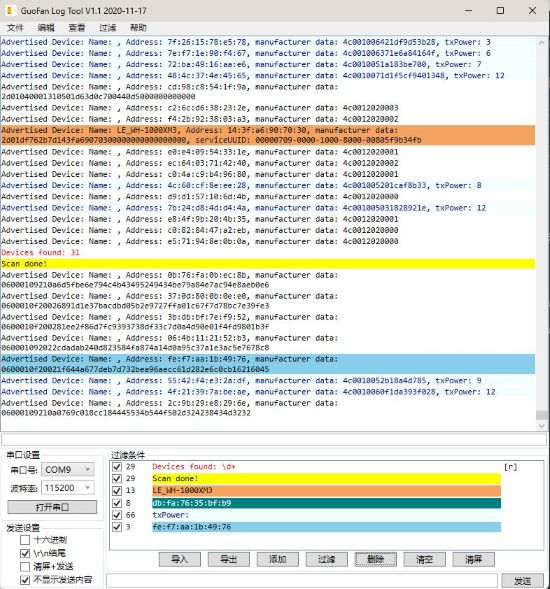

开发经验在博客：https://www.guofan.fun/wpflogtool/

## 导入、导出过滤器到文件的方式

1.	菜单-文件-导入/导出过滤器
2.	过滤器显示框下的「导入/导出」按钮

## 添加过滤器的方式

1.	菜单-过滤-新增过滤器
2.	Ctrl+N
3.	双击日志显示界面
4.	过滤器显示框下方的「添加」按钮

## 只显示高亮/显示全部日志的方式

1.	菜单-查看-只显示过滤行
2.	Ctrl+H
3.	过滤器显示框下方的「过滤/全部」按钮

## 其他

1.	编辑功能，例如搜索(Ctrl+F)在日志采集状态下不能使用
2.	可将日志文件拖放至界面，或者对日志文件右键使用此工具打开进入日志分析模式
3.	菜单-编辑-选项中可以更改日志存放位置

